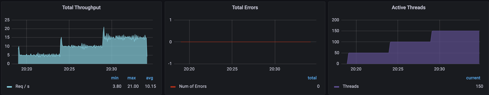
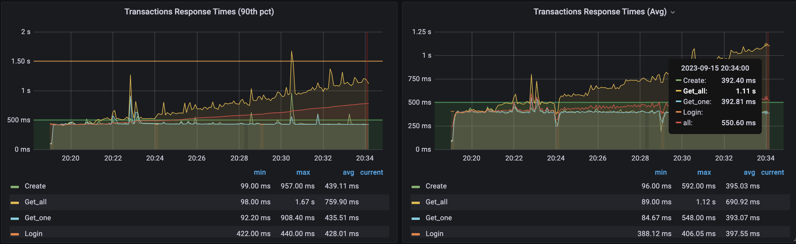
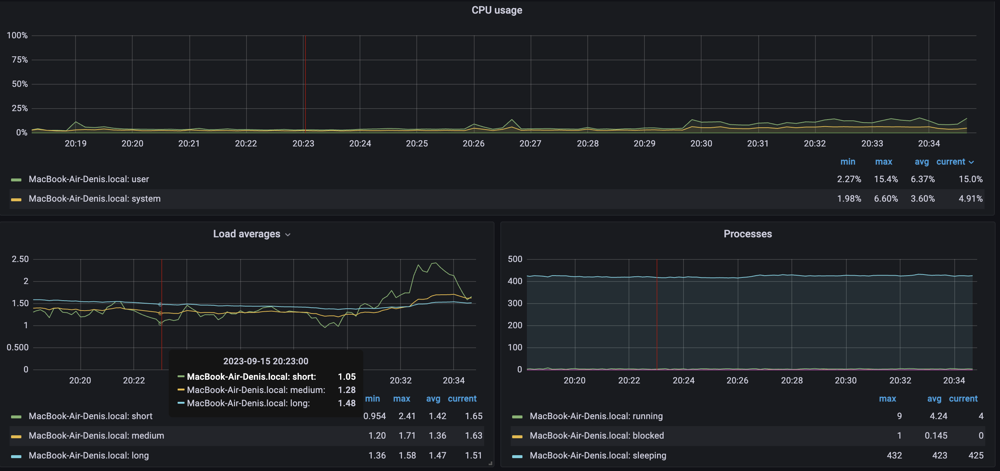
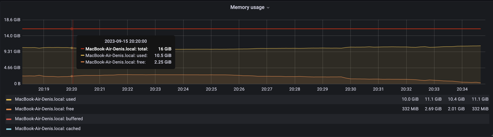
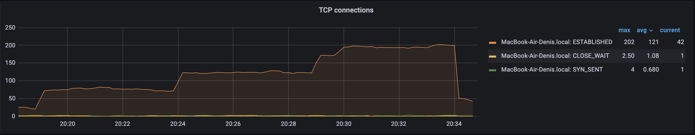
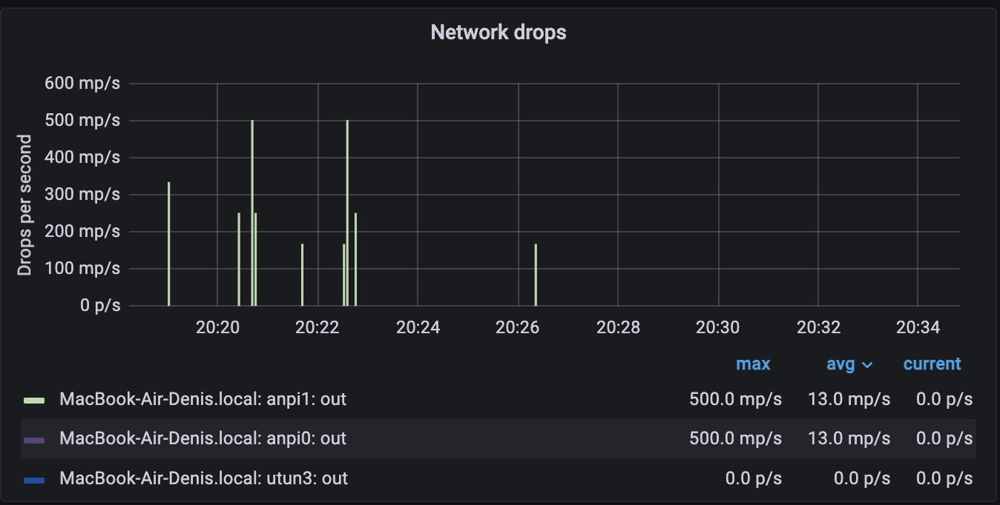
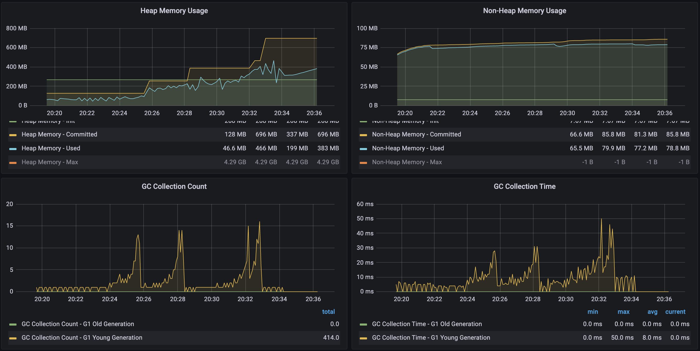

# Результаты по тестовому заданию
_____

### 1. В корне проекта лежат:
> + **[Папка с HTML отчетом](results/index.html)**  
> + **[JMX сценарий](testslotegrator_5-10-15rps_duration-5min.jmx)**  
> + **[CSV файл со статистикой по операциям](results_15092023_5-10-15rps_duration-5min.csv)**

### 2. Подготовка к тесту:
- [x] Анализ тестового задания
- [x] Разработка скрипта сценария нагрузки
- [x] Разворачивание мониторинга
    - [x] Telegraf
    - [x] InfluxDB
    - [x] Grafana
    - [x] Jolokia (мониторинг JVM метрик)
- [x] Запуск отладочных тестов

### 3. Ограничения к тестированию:
* Разбивка по интенсивности подбиралась из расчета (заданная интенсивность * %операций/100%) (можно было посчитать в долях, неясно из задания какой способ расчета предпочтительней)
* При создании скрипта использовался plugin - Ultinate Thread Group, т.к. про плагины ничего не сказано, решил ими воспользоваться.
* Каждая операция была помещена в свою Thread Group'у, поэтому получение токена, выполнялось внутри каждой группы, единожды на каждый поток
* Операция DELETE отрабатывает после теста, для удаления созданных во время теста пользователей
* Сортировка пользователей по имени делается на каждый запрос получения списка всех пользователей
* Отсутствуют бизнес требования (Перцентили, SLA по времени отклика и т.д.)

### 4. План тестирования:
**4.1 Профиль нагрузки:**

| Имена операций | Тип запроса | RPS     |
|----------------|-------------|---------|
| Login[/api/tester/login]| POST        | 150 шт. |
| Create[/api/automationTask/create]| POST        | 0.5     |
| Get_one[/api/automationTask/getOne]| POST        | 3.5     |
| Get_all[/api/automationTask/getAll]| GET         | 1       |
| Delete_user[/api/automationTask/deleteOne/{id}]| DELETE      | 1 шт.   |

**4.2 Тест - "по тестовому заданию."**  
Принимаем за 100% - базовую интенсивность в 5rps.  
Описание теста: Нагрузка подается ступенями - 3 ступени по 5 минут каждая.  
Интенсивность на 1-й ступени - 100% от базового профиля.  
Интенсивность на 2-й ступени - 200% от базового профиля.  
Интенсивность на 3-й ступени - 300% от базового профиля.  
Время выхода пользователей на каждую ступень составляет 10 секунд.  
Цели тестирования: --- .  
Критерии успешности: --- .  

### 5. Краткий отчет по проведенному тесту:

Дата и время проведения теста:  
Часвой пояс Тбилиси (GMT+4).  
Выход на 1-ступень: 15-09-2023 с 20:18:50 до 20:19:00.  
1-я ступень: 15-09-2023 с 20:19:00 до 20:24:00.  
Выход на 2-ступень: 15-09-2023 с 20:24:00 до 20:24:10.  
2-я ступень: 15-09-2023 с 20:24:10 до 20:29:10.  
Выход на 3-ступень: 15-09-2023 с 20:29:10 до 20:29:20.  
3-я ступень: 15-09-2023 с 20:29:20 до 20:33:20.  

Тест - "по тестовому заданию." прошел __успешно__.

**5.1 Графики (ниже отображены графики, только необходимые для `краткого` отчета)**    
**5.2 Времена отклика:**

*__Total Throughput (общее количество rps), Tоtal Errors (общее количество ошибок), Active Threads (количество виртуальных пользователей).__*  
  `На графике Total Throughput наблюдаем резкие скачки интенсивности при выходе на новую ступень, по причине вызова операции Login, при добавлении каждого нового пользователя(потока).`[см. тут](./Графики/3.png)
     

*__90-й перцентиль по временам отклика, Среднее время по временам отклика.__*  
  `Просадки в 20:24 и в 20:29 на графике "Среднее время по временам отклика" вызваны той же причиной, что описана на графике выше.`[см. тут](./Графики/4.png)  
  `Скачки с 20:22 до 20:23 на графике "90-й перцентиль по временам отклика" обусловлены долгим временем отклика от сервиса, надо смотреть мониторинг и логи самого сервиса, скорее всего долго отрабатывал запрос Get_all, тем самым потянул за собой долгую обработку запроса Get_one, утиллизация железа локального хоста и JVM метрик в это время была самая низкая за весь тест, см. на графиках ниже. Так же наблюдается линейный рост у операции Get_all`

**5.3 Утиллизация железа:**

*__CPU usage (общая утилизация процессора в %), Load averages (количество процессов в очереди), Processe (общее количество процессов)__*  
  `Небольшие скачки на графике CPU Usage в 20:26 - 20:27 связаны с активным чтением с жесткого диска, (инфраструктурные проблемы), см. ниже график Чтение/Запись с ЖД. На результаты теста не повлияло.`  
  `Небольшой рост на графике CPU Usage с 20:30 до конца теста обусловлен ростом очереди процессов. На результаты теста не повлияло`
     

*__Memory usage (утиллизация ОЗУ)__*  
  `Рост используемой памяти на протяжении всего теста может не относиться к утечке памяти, нужны дополнительные тесты, чтобы это утверждать.`
     

*__Чтение/Запись с ЖД__*  
  `Активное обращение к диску в 20:26 - 20:27 связано с работой с файлами на локальном хосте.`
     

*__Количество TCP соединений* 
  `ни единого обрыва)`
     

*__Количество TCP соединений__*  
  `была небольшая потеря пакетов, скорее всего из-за нестабильной работы сети провайдера города Тбилиси.`

**5.4 JVM метрики:**

*__Heap Memory Usage (Размер памяти выделенной под Heap), Non-Heap Memory Usage (Размер памяти выделенный под native код), GC Collection Count (количество раз вызова GC), GC Collection Count (Время работы GC).__*  
  `Heap немного растет, но опять же однозначно утверждать, что это утечка мы не можем, нужно больше данных.`
     

### 6. Выводы:
На данной нагрузке сервис работает __исправно__.
Какие оптимизации можно предложить на данный момент?
На стороне сервиса кэшировать данные по операции Get_all, судя по всему, сервис при каждом запросе собирает эти данные поновой и отдает клиенту.
Либо оптимизировать сбор данных по клиенту, например настроить индексы или же заняться оптимизацией запросов к БД.
Либо можно настроить прокси, который будет резать лишние запросы к данному эндпоинту до 1-2 rps.
